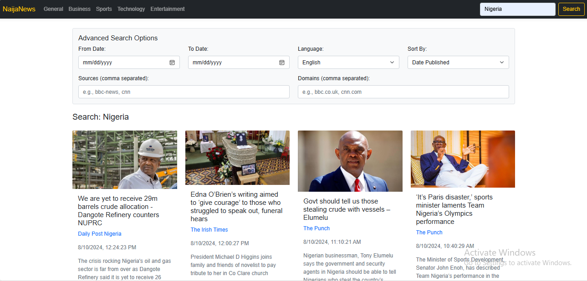

# NaijaNews



NaijaNews is a web application that provides users with the latest news headlines, categorized by various topics such as General, Business, Sports, Technology, and Entertainment. The app also features an advanced search option that allows users to search for news articles based on specific criteria like date range, language, sources, and more.

## Table of Contents

- [Features](#features)
- [Technologies Used](#technologies-used)
- [NewsAPI Key](#newsapi-key)

## Features

- **Responsive Design**: The layout adjusts to various screen sizes, providing a seamless experience on both desktop and mobile devices.
- **News Categories**: Browse news articles categorized into General, Business, Sports, Technology, and Entertainment.
- **Advanced Search**: Filter news by date range, language, sources, and sort by relevance, popularity, or publication date.
- **API Integration**: Fetches live news data from the NewsAPI.

## Technologies Used

- **HTML5**: For structuring the content on the web pages.
- **CSS3**: For styling the application, including responsive design with Bootstrap.
- **Bootstrap 5**: For responsive layouts and pre-built components like the navbar, forms, and cards.
- **JavaScript**: For dynamic content loading and interaction, including API requests and DOM manipulation.
- **NewsAPI**: Provides live news data from various sources.

## NewsAPI Key

- Sign up at [NewsAPI](https://newsapi.org/) to get an API key.
   - Open `index.js` and replace `const API_KEY = "";` with your API key:
     ```javascript
     const API_KEY = "your-api-key-here";
     ```

